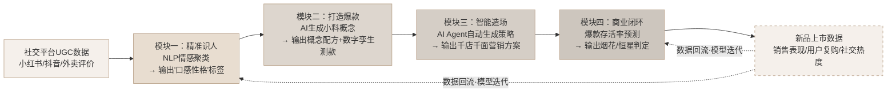

# 星河引擎 · 数据流向闭环图

本方案四大模块并非独立运作，而是形成完整的数据流转链路：

### 数据流转说明

| 阶段 | 输入 | 处理 | 输出 |
|------|------|------|------|
| 1 精准识人 | 小红书/抖音/外卖UGC评价 | NLP情感聚类 | 口感性格标签（如咀嚼解压党） |
| 2 打造爆款 | 口感性格标签 | AI生成式共创 + 数字孪生测款 | 小料概念配方 + 测款数据 |
| 3 智能造场 | 小料概念 + 门店商圈属性 | AI Agent自动生成策略 | 千店千面营销话术与海报 |
| 4 商业闭环 | 门店销售数据 + 社交热度 | 爆款存活率预测模型 | 烟花型/恒星型判定决策 |
| 5 回流优化 | 新品上市真实表现 | 模型参数校准 | 持续提升预测准确率 |
